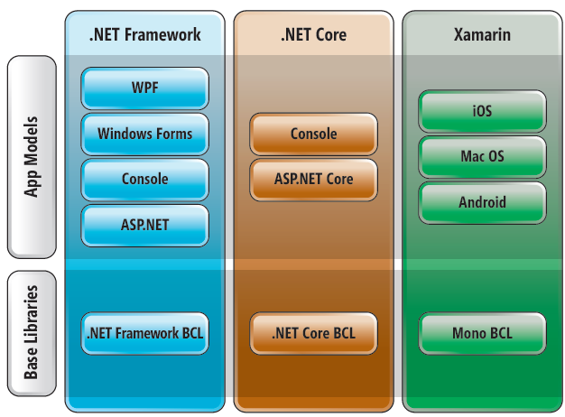
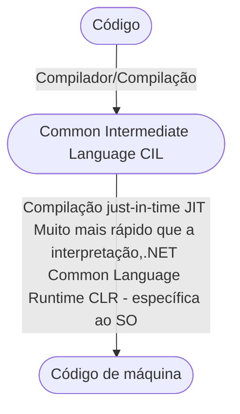
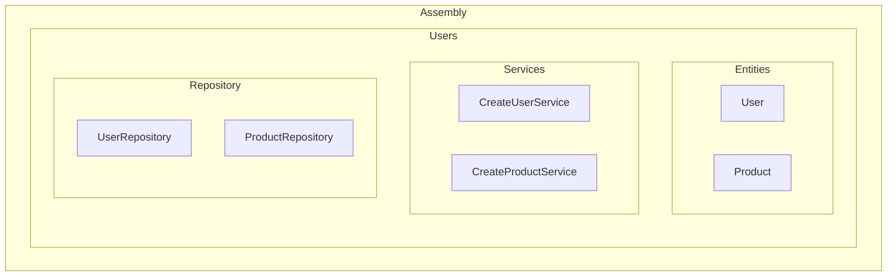

# Intrudução a Linguagem C#

## Introdução a C#

#### C# e .NET
- C#        > Linguagem de programação
- .NET      > Plataforma de desenvolvimento
- **Composto por:**
    - BCL
        - Biblioteca de classes base
        - Conjunto de funcionalidades
    - CLR
        - Máquina virtual
        - Executa programas feitos em DotNet
##### Implementação
- .NET Standard é uma especificação

|               |           SO          |  Open Source | Propósito |
|:-------------:|:---------------------:|:------------:|:---------:|
|.Net Standard  |-                      |       Sim    |Especificação do .NET|
|.Net Framework |Windows                |       Não    |Usado para criar aplicativos windows desktop(Console gráfico) e aplicativos web ASP.NET rodando sobre o IIS|
|Mono           |Vários                 |       Sim    |Usado pra cria aplicativos e jogos multiplataforma|
|Xamarin        |IOS, Android, Mac OS   |       Sim    |Usado pra cria aplicativos móveis híbridos para IOS e Android, e também para desktop Mac OS |
|.NET Core      |Windows, Linuz e Mac OS|       Sim    |Usado pra cria aplicativos modo console multiplataforma, e também para criar aplicativos web ASP.NET Core e serviços para a nuvem|

[Referência](https://docs.microsoft.com/pt-br/archive/msdn-magazine/2017/september/net-standard-demystifying-net-core-and-net-standard)

#### Compilação e interpretação
- Compilação e interpretação
    - Linguagens compiladas: C, C++
    - Linguagens interpretadas: PHP, JavaScript
    - Linguagens pré-compiladas + máquina virtual: Java, C#

#### Modelo de execução

##

#### Estrutura de uma aplicação C#
##### Namespace = agrupamento LÓGICO de classes relacionadas
- Assembly (DLL ou EXE) = Agrupamento FÍSICO de classes  relacionadas (build)

#### Instalação do Visual Studio Community
[Requisitos VS 2022](https://docs.microsoft.com/pt-br/visualstudio/releases/2022/system-requirements)

[Baixar Visual Studio](https://visualstudio.microsoft.com/pt-br/downloads/)

- Carga de Trabalho
    - ASP.NET e Desenvovlvimento WEB
    - Desenvolvimento para Azure
    - Desenvolvimento pra desktop com .NET
    - Desenvolvimento da plataforma universal do windows
    - Processamento e armazenamento de dados
    - Desenvolvimento multiplataforma com .NET Core

#### Primeiro programa em C# no Visual Studio
- Botão do wondows
- Visual Studio
- Logar
- Escolher Layout
- Continuar sem código
- Criar Projeto
    - Arquivo > Novo > Projeto
    - Aplicativo de console .NET Core
    - Próximo
    - Nome do projeto
    - Local onde será salvo
    - Criar

#### Estrutura básica de um programa C#
- Estrutura de arquivos
    - **Arquivo de solução, Onde abre o projeto**
    - Arquivo .sln
    - **Arquivo de configuração, para adicionar dependências**
    - Arquivo .csproj
    - **Arquivo da linguagem C#**
    - Classe principal .cs
    - **Arquivo Compilados**
    - Subpastas obj e bin
- Program.cs
    - Cláusulas using: referências a outros namespaces
    - Namespace
    - Classe
    - Método
    - static void Main(string[] args)

#### Dicas do Visual Studio
- Identação automática
- **CRTL + K + D**
- Roda o projeto
- **CRTL + F5**
- Zoom
- **CRTL + Scroll do mouse**
- Alterar liguagem do sistema
    - Tools > Options > Ambiente > Configurações Internacionais > Languages
- Abrir projeto
    - Arquivo > Abrir projetos recentes
    - Vai no projeto e clica no arquivo .sln
- Quebra de linha nas chaves
    - Tools > Options > Text editor > C# > Code style > Formatting > New lines > Desmarca as opções
