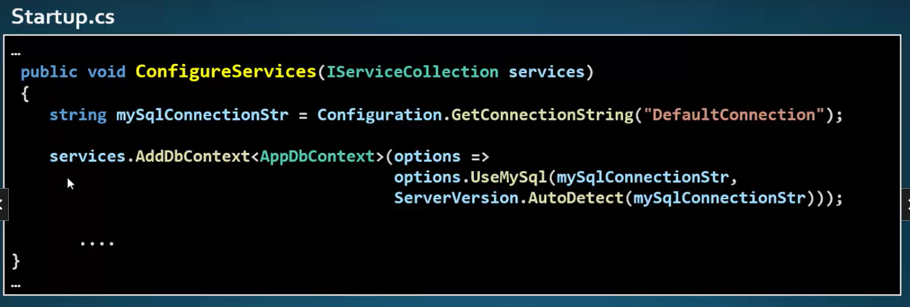

# Curso DotNet

## Instalações
### DontNet 6

[Download](https://dotnet.microsoft.com/en-us/download/dotnet/6.0)

- Verificar a versão
- **dontnet --version**

### Visual Studio 2022

[Download](https://visualstudio.microsoft.com/pt-br/downloads/)

- Apenas Next next next
- Cargas de trabalho
    - ASP.NET e desenvolvimetno Web
    - Processamento e armazenamento de dados
#### Novo
- Hot Reload
    - Reduz o tempo onde a aplicação era reconstruídos, reiniciados e refeitos.
- **Disponível para alterações em:**
    - Topos
    - Iteradores
    - Expressões assíncronas / await
    - Expressões LINQ
    - Lambdas
    - Dynamic Object
- **Não disponíveis**
    - Renomear eementos
    - Remoção de namespaces, tipos e membros
    - Modificaçõa de interfaces
    - Modificações de assinaturas de método
- **COnfiguraçõa**
    - Tools > Options > Debbugging > .NET/C++ Hot Reload


### VS Code

[Download](https://code.visualstudio.com/download)

- **Extersões**
- C# for VS Code

## String de conexão
- appsetting.json
```
{
    "ConnectionStrings": {
        "DefaultConnection": "Server=localhost;DataBase=CatalogoDB;Uid=mac;Pwd=senha"
    }
}
```
- Instalar provedor para acessar o Mysql
- **Pomelo.EntityFrameworkCore.MySql**
- **Via console**
- Install-Package Pomelo.EntityFrameworkCore.MySql
- dotnet add package Pomelo.EntityFrameworkCore.MySql
- **Menu Tools > Manage Nuget Packages for solution**
- Até o DotNet 5 era feito assim:



- A partir da versão 6 a configuração é feita em **Program.cs**


[Mais informações](https://www.connectionstrings.com/mysql/)

