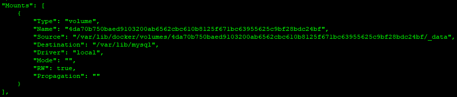
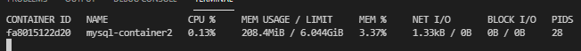
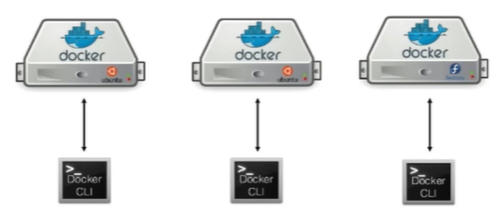
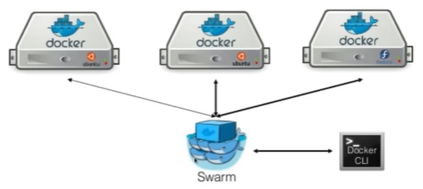

# Docker

### O que é Docker
- É uma containerização para criação de containers Linux

### Instalar docker no Linux
- [Referência](https://docs.docker.com/engine/install/ubuntu/)
- Vê versão do linux
    - cat /etc/\*realease\*
- curl -fsSL https://get.docker.com -o get-docker.sh
- sudo sh get-docker.sh
- docker version
- Status do Docker
    - systemctl status docker
- Se der error de:
```
Cannot connect to the Docker daemon at unix:///var/run/docker.sock. Is the docker daemon running?
```
- verifique se o docker esta rodando
	- sudo service docker status
	- sudo service docker start
- Rode o seguinte comando: **docker ps**
- Caso apresente o erro de 
```
Got permission denied while trying to connect to the Docker daemon socket at unix:///var/run/docker.sock: Get "http://%2Fvar%2Frun%2Fdocker.sock/v1.24/containers/json": dial unix /var/run/docker.sock: connect: permission denied
```
- Tem que criar um grupo e um usuário para o docker
	- criar grupo: **sudo groupadd docker**
	- Criar usuário e adicionar ao grupo: **sudo usermod -aG docker $USER**
	- e por último: **newgrp docker**
- docker ps


### Instalando Docker no Windows
- Power Shell como administrador
- Verifique se a Subsistema do Windows para linux está ativada
    - Painel de Controle
        - Programas e Recursos
            - Ativar ou desativar recursos do windows
- dism.exe /online /enable-feature /featurename:Microsoft-Windows-Subsystem-Linux /all /norestart
- atualiza Windows
- dism.exe /online /enable-feature /featurename:VirtualMachinePlatform /all /norestart
- [Baixe o arquivo](https://wslstorestorage.blob.core.windows.net/wslblob/wsl_update_x64.msi)
- pelo Power Shell, entre na pasta onde está o arquivo baixado
- Start-Process .\wsl_update_x64.msi
- wsl --set-default-version 2
    - Caso queira você pode entrar na loja do windows e baixar a versão do linux para roda dentro do windows
- Instalar o Docker Desktop Installer.exe
- Versão do Docker
    - docker --version
- Reinicie o PC
- caso de erro ao startar o Docker Desktop
- [Reinstale o wsl](https://wslstorestorage.blob.core.windows.net/wslblob/wsl_update_x64.msi)
#### Referência
- [Instalar o Docker no Windows](https://docs.docker.com/desktop/windows/install/#system-requirements-for-wsl-2-backend)
- [WSL](https://docs.microsoft.com/en-us/windows/wsl/install-win10)


### Baixando imagem
- [docker hub](https://hub.docker.com/)
- docker pull hello-world
- Vê todas as imagens
    - docker images
- Executa o container
    - docker run hello-world
- Exiber todos os container
    - docker ps -a
### Executando container
- docker pull ubuntu
- docker run ubuntu
- Executa o container por 10 segundos
    - docker run ubuntu sleep 10
- executa o container e já entra dentro dele
    - docker run -it ubuntu
    

###  Inspecionado conatiner
```
 docker inspect <nome-container> | grep -i mem
```
- Exemplo:
    -  docker inspect pep | grep -i mem
### Executando aplicações no container
- docker --help
- docker run -dti ubuntu
- docker exec -it id_container /bin/bash

### Excluir container
- docker container rm id_container

### Excluir Imagem
- docker image rm id_container

### Dando um nome ao container
- docker container run -dti --name my-linux ubuntu

### Copiando arquivo local para container
- Cria diretório dentro do container sem abrir o bash
    - docker exec my-linux mkdir /destino
- docker cp nome-arquivo.extensão my-linux:/destino

### Copiando arquivo container para local
- docker cp my-linux:/destino/nome-arquivo.extensão teste.txt

### Tags
- docker pull debian:9

### Criando container com MySql
- docker pull mysql
- docker run -e MYSQL_ROOT_PASSWORD=123456 --name mysql-container -d -p 3306:3306 mysql
    - **-e** declarando uma variável
    - **-d** em backgroud
    - **-p** definindo uma porta
    - **-name** nome para o container
- docker exec -it mysql-container bin/bash
- mysql -u root -p --protocol=tcp
- **CREATE DATABASE aula;**
- **show databases;**
- docker inspect mysql-container

- mysql -u root -p --protocol=tcp


### Acessando container externamente
- Dentro do bash do container
    - ip a
    - copiar ip
    - cliente mysql 
        - workbench
        - sequeler
            - Menu hambugger
            - New connection
            - nome conexão
            - banco
            - host: ip do container
            - nome do banco
            - user
            - pass- connect
### Parando e reiniciando container
- docker container stop mysql-A
- docker container start mysql-A

## Banco com Volume
#### Mesmo excluido os containers, eles podem ser recuperados apenas apontando para o mesmo caminho onde os dados foram gravados
- docker run -e MYSQL_ROOT_PASSWORD=Senha123 --name mysql-A -d -p 3306:3306 --volume=/data:/var/lib/mysql mysql
- WINDOWS
    - docker run -e MYSQL_ROOT_PASSWORD=123456 --name mysql-container -d -p 3306:3306 -v=y:/tst-docker/container-mysql:/var/lib/mysql mysql:5.7
- mysql -u root -p --protocol=tcp --port=3306

```
CREATE TABLE alunos (
    AlunoID int,
    Nome varchar(50),
    Sobrenome varchar(50),
    Endereco varchar(150),
    Cidade varchar(50)
);

INSERT INTO alunos (AlunoID, Nome, Sobrenome, Endereco, Cidade) 
VALUES 
(1, 'Carlos Alberto', 'da Silva', 'Av. que sobe e desce que ninguém conhece', 'Manaus');
```
- Remove container em execução, sem a necessidade de parar e depois remover
    - docker rm -f id_container

### Volumes
#### Definição
- Basicamente, temos 3 tipos de volumes ou montagens para dados persistentes:
    * Bind mounts
        - As montagens **Bind** são basicamente apenas vincular um determinado diretório ou arquivo do host dentro do contêiner:
            - docker run -v /hostDir:/conteinerDir mysql
    * Named volumes
        - volumes nomeados são volumes que você cria manualmente com o comando:
            - docker volume create nome-do-volume
        - eles são criados em /var/lib/docker/ volumes podem ser referênciados apenas por seu nome.
        - digamos que você crie um volume chamado *mysql_data*, você pode apenas referênciá-lo como o comando:
            - docker run -v mysql_data:/conteinerDir mysql
    * Dockerfile volumes
        - Tipo de volume que são criados pela instrução **VOLUME**. Esses volumes também são criados em /var/lib/docker/ volumes, mas não tem um determinado nome. O volume é criado ao executar o contêiner e são úteis para salvar dados persistentes. O desenvovedor pode dizer onde estão os dados importantes e o que deve ser persistente.
        
#### bind mount 
- docker run -dti --mount type=bind,src=/opt/teste,dst=/teste debian
- docker run -dti --mount type=bind,src=/opt/teste,dst=/teste,ro debian

#### volumes
- docker volume create teste
- docker volume ls
- **/var/lib/docker/volumes/teste/_data**
- docker run -dti --mount type=volume,src=teste,dst=teste debian
- docker volume rm teste

### Tipos de mount na prática
#### MOUNT
- docker conteiner run --help
- docker run -dti --mount type=bind,src=/data/debian-A,dst=/data debian
    - src: caminho na sua máquina
    - dst: caminho no conteiner
- docker exec -ti nome_imagem bash
    - cd /data
    - touch file.txt
    - pronto, arquivo criado dentro do conteiner
    - se olhar na máquina host no caminho especificado, estará lá o arquivo que foi criado no conteiner
- criando arquivo somente leitura
    - docker run -dti --mount type=bind,src=/data/debian-A,dst=/data,ro debian

#### VOLUME
- docker volume ls
- docker volume create data-debian
- este arquivo é criado na pasta padrão do docker, em: /var/lib/docker/
- *Montar volume dentro do conteiner*
    - docker run -dti --name debian_container --mount type=volume,src=nome-do-volume,dst=/data debian
    - docker exec -ti debian_container bash
    - cd /data
    - touch file3.txt
- docker volume create centos-A
- docker run -dti --mount type=volume,src=centos-A,dst=/data --name centos-A centos
- docker inspect centos-A
    - verifica Mounts
- docker rm -f centos-A
- exclui todos os volumes que não estão em uso
    - docker volume prune

### Exemplo - Dockerfile
#### Usando Apache
- docker run  --name apache-A -d -p 80:80 --volume=/data/-apache-A:/usr/local/apache2/htdocs/ httpd
- Cria nessa pasta um arquivo index.html e coloca o código abaixo
```
<!DOCTYPE html>
<html>
<head>
<meta charset="UTF-8"/>
<title>Exemplo Apache</title>
</head>
<body>
<h1> OK !! Apache funcionando!!!!! </h1>
</body>
</html>
```
- docker run  --name php-A -d -p 8080:80 --volume=/data/php-A:/var/www/html php:7.4-apache
- Cria nessa pasta um arquivo index.php e coloca o código abaixo
```
<?php
phpinfo();
?>
```
> Mostra o status do container
    - docker stats nome-container


## Limitando memória e CPU

- sair, aperte CRTL+C
- docker stats php-A
- Especifíca a quantidade de memória e a porcentagem da CPU que deve usar
    - docker update php-A -m 128M --cpus 0.2
- docker run --name ubuntu-C -dti -m 128M --cpus 0.2 ubuntu
- Entre no container, aplicação para teste de stress
    - apt update && apt install stress
    - stress --cpu 1 --vm-bytes 50m --vm 1 --vm-bytes 50m
        - **--vm** pacote
        - **--vm-bytes** volume de dados a ser enviado
##### docker info
- informações do servidor
##### docker container logs nome-container
- logs de determinado container
##### docker container top nome-container
- quais processos estão em execução no container

## REDES
- ip a
    - mostra as redes virtuais
- docker network --help
- docker network ls
- docker container inspect brigde
    - mostra quais containers estão associados a essa rede
- apt-get install iputils-ping
- docker network create minha-rede
- containers criados na mesma rede podem se comunicar
- docker run -dit --name Ubuntu-A --network minha-rede  ubuntu
- docker run -dit --name Ubuntu-B --network minha-rede  ubuntu

## Dockerfile com python

### Python 
- criando o script
    - nano dockerfile
```
FROM ubuntu
RUN apt update && apt install -y python3 && apt clean
COPY app.py /opt/app.py
CMD python3 /opt/app.py
```
- Executando o script
    - docker build . -t python-ubuntu
- docker run -ti --name my-app python-ubuntu


#### Exemplo 02 - Site Básico
- arquivo da aula
    - wget http://site1368633667.hospedagemdesites.ws/site1.zip
- compactar os arquivos, linux só aceita o .tar
    - compacta todos os arquivos da pasta atual
    - tar -czf site.tar ./
```
FROM debian

RUN apt-get update && apt-get install -y apache2 && apt-get clean

ENV APACHE_LOCK="var/lock"                      // Evita mais de uma instância no mesmo container                
ENV APACHE_PID_FILE="var/run/apache2.pid"       // Arquivo com o PID número de identificação do processo         
ENV APACHE_RUN_USER="www-data"                  // Usuário que executa o apache
ENV APACHE_RUN_GROUP="www-data"                 // Grupo
ENV APACHE_LOG_DIR="/var/log/apache2"           // Logs do apache

ADD site.tar /var/www/html                      // Descompacta o arquivo nessa pasta
LABEL description="Apache Webserver 1.0"         
VOLUME /var/www/html/
EXPOSE 80
ENTRYPOINT ["/usr/sbin/apachectl"]              // Local de onde o arquivo do apache será executado

CMD ["-D", "FOREGROUND"]                        // Afirma que o arquivo **apachectl** será executado em primeiro plano
```
- docker image build -t debian-apache:1.0 .
- docker run  -dti -p 80:80 --name meu-apache debian-apache:1.0

</details>

#### Exemplo 03
- app.py
```
nome = input("Qual é o seu nome? ")
	print (nome)
```
- Dockerfile do python
```
FROM python

WORKDIR /usr/src/app
COPY app.py /usr/src/app
CMD [ "python", "./app.py" ]
```
#### Exemplo 04
- docker pull golang
- docker pull alpine

```
package main
import (
    "fmt"
)

func main() {
  fmt.Println("Qual é o seu nome:? ")
  var name string
  fmt.Scanln(&name)
  fmt.Printf("Oi, %s! Eu sou a linguagem Go! ", name)
}
```
- Dockerfile
```
FROM golang as exec

COPY app.go /go/src/app/

ENV GO111MODULE=auto

WORKDIR /go/src/app

RUN go build -o app.go .

FROM alpine

WORKDIR /appexec
COPY --from=exec /go/src/app/ /appexec
RUN chmod -R 755 /appexec
ENTRYPOINT ./app.go
```
- docker image build -t app-go:1.0 .
- docker run -ti  app-go:1.0
####  Realizando o upload de imagens para o Docker Hub
- docker login
- docker build . -t nome-de-usuário/my-go=app:1.0
- docker push nome-deu-usuário/my-go=app:1.0

#### Registry: Criando um servidor de imagens
- docker run -d -p 5000:5000 --restart=always --name registry registry:2
- Caso esteja logado no docker hub
    - docker logout
- docker image tag [id_container] localhost:5000/meu-apache:1.0
- curl localhost:5000/v2/_catalog
    - {"repositories":[]}
- docker push  localhost:5000/my-go-app:1.0
- nano /etc/docker/daemon.json 
- 	{ "insecure-registries":["10.0.0.189:5000"] }
- systemctl restart docker
- docker push  localhost:5000/my-go-app:1.0


## DOCKER COMPOSER

### Instalação
- Pré-requisitos
  - Docker Compose requires Docker Engine.
  - Docker Compose plugin requires Docker CLI.
- Atualizar linux
  sudo apt-get update
- Instalação
  - sudo apt-get install docker-compose-plugin 	
- Versão do compose
  - docker compose version
- [Referência](https://docs.docker.com/compose/install/)

### Definição
- Docker Compose é uma ferramenta desenvolvida para ajudar a definir e compartilhar aplicativos com vários contêiners. Com o compose, você pode criar um arquivo YAML para definir os serviços e com um único comando, pode rodar todos os contêinrs ou para-los.
- [Versão do Docker](https://docs.docker.com/compose/compose-file/compose-versioning/)

#### Exemplo 01
- Nome do arquivo
    - docker-compose.yml
```
version: '3.7'

services:
  mysqlsrv:
    image: mysql:5.7
    environment:
      MYSQL_ROOT_PASSWORD: "Senha123"
      MYSQL_DATABASE: "testedb"
    ports:
      - "3306:3306"
    volumes:
      - /data/mysql-C:/var/lib/mysql
    networks:
      - minha-rede

  adminer:
    image: adminer
    ports:
      - 8080:8080
    networks:
      - minha-rede

networks: 
  minha-rede:
    driver: bridge
```
- Contrói os serviços
    - docker-compose up -d
- Para os serviços
    - docker-compose down

#### Exemplo 02
- Nome do arquivo
    - docker-compose.yml
```
version: "3.7"

services:
  web:
    image: webdevops/php-apache:alpine-php7
    ports:
      - "4500:80"
    volumes:
      - /data/php/:/app
    networks:
      - minha-rede
  db:
    image: mysql:5.7
    environment:
      MYSQL_ROOT_PASSWORD: "Senha123"
      MYSQL_DATABASE: "testedb"
    ports:
      - "3306:3306"
    volumes:
      - /data/mysql-C:/var/lib/mysql
    networks:
      - minha-rede
  phpmyadmin:
    image: phpmyadmin/phpmyadmin
    environment:
      MYSQL_ROOT_PASSWORD: "Senha123"
    ports:
      - "8080:80"
    volumes:
      - /data/php/admin/uploads.ini:/usr/local/etc/php/conf.d/php-phpmyadmin.ini
    networks:
      - minha-rede
networks:
   minha-rede:
     driver: bridge
```

- uploads.ini
    - file_uploads = On
    - memory_limit = 500M
    - upload_max_filesize = 500M
    - post_max_size = 500M
    - max_execution_time = 600
    - max_file_uploads = 50000
    - max_execution_time = 5000
    - max_input_time = 5000

- Página
    - index.php
```
<html>

<head>
<title>Exemplo PHP</title>
</head>

<?php
ini_set("display_errors", 1);
header('Content-Type: text/html; charset=iso-8859-1');

echo 'Versao Atual do PHP: ' . phpversion() . '<br>';

$servername = "db";
$username = "root";
$password = "Senha123";
$database = "testedb";

// Criar conexão


$link = new mysqli($servername, $username, $password, $database);

/* check connection */
if (mysqli_connect_errno()) {
    printf("Connect failed: %s\n", mysqli_connect_error());
    exit();
}

$query = "SELECT * FROM tabela_exemplo";

if ($result = mysqli_query($link, $query)) {

    
    while ($row = mysqli_fetch_assoc($result)) {
        printf ("%s %s %s <br>", $row["nome"], $row["cidade"], $row["salario"]);
    }

    
    mysqli_free_result($result);
}


mysqli_close($link);

?>

</html>
```
- [Exemplos de Compose Oficial](https://github.com/docker/awesome-compose)

## Docker Machine
- é uma ferramenta que permite instalar o docker **Engine** em um hosts **virtuais** e gerenciar os hosts com comandos docker-machine. Você pode usar o Docker Machine para criar **hosts** Docker em seu Mac local ou windows, na rede de sua empresa, em seu data center ou provedores de nuvem como Azure, AWS ou DigitalOcean.
- **Docker Engine**: Docker como gerenciador de imagem e de containers na nuvem ou em host virtuais

- [Docker Machine](https://docs.docker.com/machine/)
- [Install Docker Machine](https://docs.docker.com/machine/install-machine/)
- Caso de Uso
    - instalar o docker-machine na sua máquina, sem o docker
    - tem que ter o virtual box instalado
    - hyper-v : no Windows
- Comandos
    - docker-machine --version
    - docker-machine ls
    - docker-machine create --help
    - docker-machine create --driver virtualbox --virtualbox-disk-size "50000" --virtualbox-memory "2048" my-docker-vm
        - isso cria uma máquina virtual com S.O e com docker instalado
    - docker-machine ls
    - docker-machine ip my-docker-vm
    - docker-machine ssh my-docker-vm
        - acessa a máquina via SSH
    - docker-machine stop my-docker-vm
    - docker-machine start my-docker-vm
    - docker-machine env my-docker-vm
    - outra forma de acesso remoto
        - Acessar a máquina FEDORA
            - eval $(dcoker-machine env my-docker-vm)
        - Sair da máquina
            - eval $(dcoker-machine env -u)
- Teste na AWS
    - Console AWS
    - IAM **Criar usuário**
    - Usuários
    - Adicionar usuário
        - Nome para usuário
            - [] Acesso ao painel
            - [] Console
            - Senha
        - Definir permissões
            - [] Adicionar usuário ao grupo
            - [] Copiar permissões de um usuário existente
            - [x] Anexar politica existente
                - AdministratorAccess
            - Tag para facilita a busca do usuário
            - revisão
            - Dados importantes
                - ID da chave de acesso
                - Chave de acesso secreta
        - [Passo 2](https://docs.docker.com/machine/examples/aws/)
        - cria pasta **.aws** no diretório do usuário
        - entra na pasta
        - cria arquivo **credentials**, com
```
[default]
aws_access_key_id = AKID1234567890
aws_secret_access_key = MY-SECRET-KEY
```
        - substitua seus dados por seu ID e Chave
- docker-machine create --driver amazonec2 --help
- docker-machine create --driver amazonec2 --amazonec2-region "sa-east-1" my-aws-vm
    - Isso cria uma máquina virtual na AWS na região de São Paulo
- docker-machine ssh my-aws-vm
- sudo docker run --name my-apache -d -p 80:80 httpd
- Excluíndo máquina virtual
    - docker-machine rm -f my-docker-vm

## Docker Swarm
##### O que é um Cluster
    - Um **Cluster** (do inglês cluster:'grupo, aglomerado') consiste em computadores ligados que trabalham em conjunto, de modo que em muitos aspectos, podem ser considerados como um único sistema. Computadores em cluster executam a mesma tarefa, controlado e programado por software.
    - cada computador presente em cluster pe conhecido como nó (node).
##### O que é Docker Swarm
    - É um recurso do Docker que fornce funcionalidades de orquestração de contêiner, incluindo clustering nativo de hosts do Docker e agendamento de cargas de trabalho de contêiners. Um grupo de hosts do Docker formam um cluster "Swarm".
##### Nós gerenciadores e nós de trabalho
- Um swarm é composto por dois tipos de hosts de contêiner: nós **gerenciadores** e nós de **trabalho**. Todos os comandos CLI do Docker para controlar e monitorar um swarm devem ser executados em um de seus nós gerenciadores. Os nós gerenciadores podem ser considerados os "zeladores" do estado Swarm — juntos, eles formam um grupo de consenso que mantém o reconhecimento do estado dos serviços em execução no swarm, e o trabalho deles é garantir que o estado real do swarm seja sempre condizente com o estado desejado, conforme definido pelo desenvolvedor ou administrador. 
- Para ingressar em um swarm, um nó de trabalho deve usar um "token de associação" gerado pelo nó gerenciador quando o swarm foi inicializado.
- Gerenciando máquina individual
- 
- Gerenciando máquinas com Swarm
- 

### Criando uma máquina para teste
- docker-machine create --driver virtualbox dw1
- docker-machine create --driver virtualbox dw2-
- docker-machine create --driver virtualbox dw3
- docker-machine ls
    - Verificar a faixa de IP
- docker-machine ssh dw1
- ip a
- docker sawrm init --advertise-addr ip-da-máquina-server
    - copie o comando e tokem que ele gerou
- exit
- docker-machine ssh dw2
- cola o comando que foi gerado na máquina gerente
- pronta, agora ele está configurado como work
    - não gerenciar o cluster, apenas recebe containers
- exit
- docker-machine ssh dw3
- cola o comando que foi gerado na máquina gerente
- exit
- docker-machine ssh dw1
- mostra todos os nós adicionados
    - docker node ls
- Replica uma imagem através de um cluster swarm
    - docker service create --name web-server --replicas 10 -p 8080:80 httpd
- docker service ps web-server
- docker node update --availability drain dw1
    - máquina gerente não receberá contêiners
    - tem que está na máquina gerente
    - se existir contêiner, ele será redirecionado para outra máquina
- Exclui um service
    - docker service rm web-server
- docker node update --help
    - docker node update --availability pause dw1
    - docker node update --availability active dw1
- docker service create --name ubuntu-server -dt --replicas 2 ubuntu
- caso não lembre mais a chave para associar um gerente ao work
    - Entre no Manager "Máquina principal"
    - docker swarn join-token worker
        - ele mostra novamente o token
- Entre na nova máquina e coloe o comando, pronto ela está adicionar a máquina principal
- docker-machine stop dw1
- docker-machine start dw1
- adicionar um worker para Manange
    - docker node ls
    - docker node promote dw2
    - docker node ls
- **É necessário pelo menos 51% dos managers ativos para que não caia os contêinrs**

### Volumes em um cluster Swarm
- Precisa de uma tecnologia para distribuir arquivos entre hosts
- NFS
- Precisa de Sistemas Operacionais mais robustos
- Linux Server
- Se for usar em máquinas virtuais
    - Clona primeira máquina e gerar endereços MAC diferentes
    - Rede modo bridge
- Na nuvem
    - VPC
    - Verificar Região
        - Tag
        - IP padrão classe C
        - Create vpc
        - copiar o ID
        - Criar subrede
            - Escolha o ID gerado anteriormente
            - Nome
            - Específicar grupo
            - Faixa de Ip total
                - Tipo: 172.31.0.0/24 
            - create subrede
        - Internet Gateway
            - Nome TAG
            - create
            - Attach to a VPC
            - busca a rede local
        - Roteamento para esse gateway
            - Route Tables
                - seleciona o roteamento da rede local
                - edite routers
                - Add route
                    - 0.0.0.0/0 - ID do gateway
                    - Save
    - Na máquina Host
    - docker-machine create --driver amazonec2 --amazonec2-region "us-east-1" --amazonec2-zone a --amazonec2-vpc-id "id-do-vpc" --amazonec2-subnet-id "subnet-003616161616" aws-l
    - isso é a configuração para a máquina 1
    - Entrando na máquina
        - docker-machine ssh aws-1
    - definir um root para a máquina
        - sudo passwd root
    - ip a
        - eth0: Máquina host
        - docker0: ip docker
    - docker swarn init
        - Copiar o TOKEN
    - Sai da aws-1 e vá para aws-2
    - **Se for adicionar essa máquina ao cluster ele não deixa por causa do Firewall da AWS, por isso é necessário ir na aws e configurar as regras de segurança para dar acesso a porta do swarm, que é a *3377***
    - Quando cria uma máquina ele adiciona a um grupo de segurança específico
    - Na instâncias
    - Aba segurança
        - Grupos de segurança
        - Editar regra de entrada
        - Adicionar regra
            - 2377
            - todos os ips
        - salvar
    - Adicionando a máquina
    - colar comando criado na máquina aws-1
        - Exemplo:
            - docker swarm join --token SWMTKN-1-5gsnd5vrsix8xpp 172.31.0.186:2377
    - HOST
    - docker node ls
    - promover aws-2
    - docker node promote aws-2
    - Criando Volume
        - docker volume create app
    - Pasta padrão onde são criados os volumes dentro do docker
        - cd /var/lib/docker/volumes/app
        - cd _data/
        - wget htttp://site113134.hospedagemdesites.ws/site.zip
        - unzip site1.zip
        - se não tiver instalado
            - sudo apt-get install unzip
    - Criando um serviço com a imagem do apache
    - docker service create --name web-server --replicas 3 -dt -p 8080:80 --mount type=volume,src=app,dst=/usr/local/apache2/htdocs/ httpd
    - docker service ls
    - Adicionar mais regras na política de seguraça
    - liberar porta HTTP 80  Para todos
    - liberar porta TCP personalizado 8080 Para todos
    - Pegando o IP público com a porta 8080, da para acessar o site
    - **Mas o volume não foi replicado para todas as máquinas**
    - Para replicar
        - Máquina AWS-1
        - apt-get install nsf-server
        - systemctl status nfs-server
        - systemctl enable nfs-server
        1. Copiar o caminho do volume
        2. nano /etc/exports
        3. Escreva o seguinte nesse arquivo
            - /var/lib/docker/volumes/app/_data *(rw,sync,subtree_check)
            - Salve
        4. exportfs -ar
        5. pega o ip da aws-1
        6. vai na máquina AWS-2
        7. showmount -e 172.31.0.186
            - Se der erro
            - apt-get install nft-common
            - vai na AWS
            - adicionar nova regra de entrada
            - NFS Acesso a todos
            - Todos os UDP Acesso a todos
        8. mount 172.31.0.186:/var/lib/docker/volumes/app/_data /var/lib/docker/volumes/app/_data
        9. docker service ls
        10. docker service rm we-server
        11. docker volume prune
##### Criando um conteiner de Banco de dados e fazer todas as aplicações se conectarem a ele
- na aws-1
- docker volume create data
- docker run -e MYSQL_ROOT_PASSWORD=12345 -e MYSQL_DATABASE=meubanco --name mysql-A -d -p 3306:3306 -mount type=volume,src=data,dst=/var/lib/mysql/ mysql:5.7
- Liberar a porta 3306 no console da aws, nas regras de entrada
- pega ip público da máquina
- Acessa o banco
```
CREATE TABLE dados (
    AlunoID int,
    Nome varchar(50),
    Sobrenome varchar(50),
    Endereco varchar(150),
    Cidade varchar(50)
);
```
- cria um docker-composer.yml
```
version: "3.7"

services:
  web:

    image: webdevops/php-apache:alpine-php7
    ports:
      - "80:80"
    volumes:
      - app:/app

    deploy:
      replicas: 3
      resources:
        limits:
          cpus: "0.1"
          memory: 50M

  phpmyadmin:
    image: phpmyadmin/phpmyadmin
    environment:
      MYSQL_ROOT_PASSWORD: "Senha123"
      PMA_HOST: "54.234.153.24"

    deploy:
      replicas: 1
      resources:
        limits:
          cpus: "0.1"
          memory: 50M
    ports:
      - "8080:80"
    volumes:
      - php-ini:/usr/local/etc/php/conf.d/php-phpmyadmin.ini

volumes:
  app:
  php-ini:
```

- docker stack deploy -c docker-compose.yml php-app
- docker service ps php-app_phpmyadmin
- docker service ps php-app_web

- Aplicação
- cd /var/lib/docker/volumes

- nano /etc/exports 
- Replica novo volume para as outras máquinas
```
	 /var/lib/docker/volumes/php-app_app/_data *(rw,sync,subtree_check)
```
- exportfs -ar

- cola isso em cada máquina virtual e pega o ip da máquina
- **mount 172.31.0.37:/var/lib/docker/volumes/php-app_app/_data /var/lib/docker/volumes/php-app_app/_data**
- dentro do _data
- index.php
```
<html>
<head>
<title>Exemplo PHP</title>
</head>

<?php
ini_set("display_errors", 1);
header('Content-Type: text/html; charset=iso-8859-1');

echo 'Versao Atual do PHP: ' . phpversion() . '<br>';

$servername = "54.234.153.24";
$username = "root";
$password = "Senha123";
$database = "meubanco";

// Criar conexão
$link = new mysqli($servername, $username, $password, $database);

/* check connection */
if (mysqli_connect_errno()) {
    printf("Connect failed: %s\n", mysqli_connect_error());
    exit();
}

$valor_rand1 =  rand(1, 999);
$valor_rand2 = strtoupper(substr(bin2hex(random_bytes(4)), 1));


$query = "INSERT INTO dados (AlunoID, Nome, Sobrenome, Endereco, Cidade) VALUES ('$valor_rand1' , '$valor_rand2', '$valor_rand2', '$valor_rand2', '$valor_rand2')";


if ($link->query($query) === TRUE) {
  echo "New record created successfully";
} else {
  echo "Error: " . $link->error;
}

```
-  uploads.ini
``` 
file_uploads = On
memory_limit = 500M
upload_max_filesize = 500M
post_max_size = 500M
max_execution_time = 600
max_file_uploads = 50000
max_execution_time = 5000
max_input_time = 5000
```
#### Teste de carga
- Fazer cadastro
- [Site para teste de Carga](https://loader.io/)
- Ir em Target
- Domain
    - http://ip_da_maquina
- Next verify
- vai gerar um nome para você salvar como arquivo dentro da pasta _data com o mesmo nome
- nome.txt
- mesmo conteúdo do nome
- Verify no site
- Next teste
    - nome para o teste
    - quantidade de clientes acessando a máquina
    - arquivo, no caso index.php
- Run test

- No Docker
- verificar os logs
- docker logs id_conteiner

#### Criando um AWS Load Balancer
- Console AWS
- Load Balances
- Criar load balance
    - Modo classico
    - nome: Cluster-swarm
    - rede: rede onde foram criadas as máquinas
    - seleciona a subrede interna
    - next
    - aplica a um grupo de segurança
    - next
    - Nessa parte você define como será testado
        - protocolo
        - porta
        - arquivo principal
        - isso é pra quando um dos nós cair ele saiba onde vai pingar depois
    - next
    - mostra os nós que você tem
    - marque as que precisar
    - tag
        - Balance
    - resumo
    - criar
    - Copiar **Nome do DNS**
- Faça o teste de carga novamente, mas agora no lugar do IP use o nome do DNS criado no load balance

#### Criando um Proxy NGINX
- Remove load balance
- console AWS
- Load balance
- Selecione o load
    - ações
        - Excluir
- Load balance por proxy
    - Pegar o ip interno das máquinas
- mkdir /proxy
- cd /proxy
- Arquivo de configuração do proxy
    - nano nginx.conf
- Exemplo
    - IP de cada máquina
    - Porta
    - Porta para acesso ao proxy: 4500
    - Liberado para qualquer direção
```
http {
   
    upstream all {
        server 172.31.0.37:80;
        server 172.31.0.151:80;
        server 172.31.0.149:80;
    }

    server {
         listen 4500;
         location / {
              proxy_pass http://all/;
         }
    }

}


events { }
```

- nano dockerfile
```
	FROM nginx
	COPY nginx.conf /etc/nginx/nginx.conf
```

- docker build -t proxy-app .
- docker container run --name my-proxy-app -dti -p 4500:4500 proxy-app
- Libera porta 4500 no servidor que instalou, no caso aws-1, na AWS
- Pegar ip publico + porta 4500 colocar no navegador

#### Stacks e Services
- Defini qual aplicação sobe em qual cluster
- docker stack ls
    - Mostra o nome da aplicação e quantos serviços tem pra eles
- docker stack ps php-app
    - mostra onde está cada aplicação
-  docker service ls
    - mostra onde os serviços estão
- Excluir a stack
    - docker stack rm php-app
- docker volume prune

#### Node Label / Stack Deploy
- docker node ls
- **Definindo um rótulo para a máquina aws-1**
- docker node update --label-add dc=proxy-data aws-1
- nano docker-compose.yml
##### docker-composer.yml

```
version: "3.7"

services:

  proxy:

    image: proxy-app
    
    deploy:
      replicas: 1
      placement:
        constraints:
        - node.labels.dc == proxy-data
    ports:
      - "4500:4500"
    
  data:

    image: mysql:5.7
    environment:
      MYSQL_ROOT_PASSWORD: "Senha123"
      MYSQL_DATABASE: "meubanco"

    deploy:
      replicas: 1
      placement:
        constraints:
        - node.labels.dc == proxy-data
    ports:
      - "3606:3606"
    volumes:
      - data:/var/lib/mysql/


  web:

    image: webdevops/php-apache:alpine-php7
    ports:
      - "80:80"
    volumes:
      - app:/app

    deploy:
      replicas: 3
      resources:
        limits:
          cpus: "0.1"
          memory: 50M

  phpmyadmin:

    image: phpmyadmin/phpmyadmin
    environment:
      MYSQL_ROOT_PASSWORD: "Senha123"
      PMA_HOST: "34.228.25.68"

    deploy:
      replicas: 1
      resources:
        limits:
          cpus: "0.1"
          memory: 50M
      placement:
        constraints:
         - node.labels.dc == proxy-data
    ports:
      - "8080:80"
    

volumes:

  app:
  data:
```

- docker stack deploy -c docker-compose.yml php-app
- nano /etc/exports 

```
	/var/lib/docker/volumes/php-app_app/_data *(rw,sync,subtree_check)
```
- exportfs -ar

```
mount 172.31.0.227:/var/lib/docker/volumes/php-app_app/_data /var/lib/docker/volumes/php-app_app/_data
```
##### index.php

```
<html>

<head>
<title>Exemplo PHP</title>
</head>


<?php
ini_set("display_errors", 1);
header('Content-Type: text/html; charset=iso-8859-1');


echo 'Versao Atual do PHP: ' . phpversion() . '<br>';

$servername = "34.228.25.68";
$username = "root";
$password = "Senha123";
$database = "meubanco";

// Criar conexão


$link = new mysqli($servername, $username, $password, $database);

/* check connection */
if (mysqli_connect_errno()) {
    printf("Connect failed: %s\n", mysqli_connect_error());
    exit();
}

$valor_rand1 =  rand(1, 999);
$valor_rand2 = strtoupper(substr(bin2hex(random_bytes(4)), 1));


$query = "INSERT INTO dados (AlunoID, Nome, Sobrenome, Endereco, Cidade) VALUES ('$valor_rand1' , '$valor_rand2', '$valor_rand2', '$valor_rand2', '$valor_rand2')";


if ($link->query($query) === TRUE) {
  echo "New record created successfully";
} else {
  echo "Error: " . $link->error;
}

?>

</html>
```
##### SQL
```
CREATE TABLE dados (
    AlunoID int,
    Nome varchar(50),
    Sobrenome varchar(50),
    Endereco varchar(150),
    Cidade varchar(50)
);

```
- /var/lib/docker/volumes

- nano /etc/exports 
```
	 /var/lib/docker/volumes/php-app_app/_data *(rw,sync,subtree_check)
```
- exportfs -ar
- mount 172.31.0.37:/var/lib/docker/volumes/php-app_app/- - _data /var/lib/docker/volumes/php-app_app/_data


# Subindo imagens
<details>
<summary> MongoDB </summary>

### MongoDB

#### Baixando imagem
> docker pull mongo:4.2-bionic

#### Executando o mongo
> docker container run --name mongodb -p 27017:27017 -d mongo:4.2-bionic --auth

#### Entrando no container
> docker container exec -it mongodb mongo admin
	
#### Comandos: 
> show dbs
> use local
> show collections
> use pagamentos
**--auth - ainda vai criar a autenticação pra ele**

#### Para criar usuário root: 
> db.createUser({ user: "root", pwd: "123456", roles: [{ role: "userAdminAnyDatabase", db: "admin" }]})
#### Autentica o usuário , 1° User, 2° senha
> db.auth("root","123456");
	
#### Para criar um usuário num banco qualquer:
> db.createUser({ user: "andre", pwd: "0516", roles: [ "readWrite", "dbAdmin" ] })

#### Sair do mongo 
> exit

#### Entrar pelo bash
> docker exec -it mongodb bash

#### Autentica com usuário root ou usuario específico
> mongo -u root -p   ||  mongo -u andre -p --authenticationDatabase pagamentos

#### Cria a collections e inserir os dados
> use pagamentos
> db.usuarios.insertOne({"nome": "Testando o mongo"});
> db.usuarios.find();
> db.usuarios.find().pretty();
	
</details>

<details>
<summary> PostGreSQL </summary>

### PostGreSQL

#### Download imagem
> docker pull postgres:alpine

#### Rodando imagem em background
> docker  run --name postdb -e POSTGRES_PASSWORD=123456 -d -p 5432:5432 postgres:13.3-alpine
	
#### Entrado no container
> docker exec -it postgres bash
#### Entrado diretamente no banco
> docker exec -it postdb psql -U postgres --password
> docker exec -it postdb psql -U postgres

#### Bash do postgres
> psql -U postgres

#### Lista os usuários
> \du

#### Cria um banco
> create database teste;

#### Lista os bancos
> \l

#### Entra no banco
> \c teste

#### Estrutura da tabela
> \d teste
	
#### arquivo de configuração do postgres 
> less ~/.zshrc

#### Outra forma de entrar no banco
> psql -h localhost -p 5432 -U postgres

#### Sair do banco
> \q

</details>

</details>

<details>
<summary> Others </summary>

</details>
