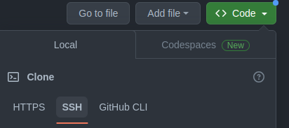

# Gerando Chave SSH para acesso ao Github

## Linux ou Git Bash no Windows

- Abra seu terminal
- Digite `sh-keygen -t ed25519 -C "teste@email.com"`
    - Gerador da chave
    - Tipo de algoritmo
    - Adiciona um comentário    (Opcional)
    - E-mail do github          (Opcional)
- Ao digitar o comando será pedido algumas informações
    - No do arquivo a ser gerado, se apenas digitar Enter, ele manterá o pdarão.
    - informa o diretório criado
    - Pede uma frase e em seguida pede para confirma-la
    - *Se adicionar a frase, sempre será necessário informa-la*
    - Mostra o nome da chave pública e privada

- Entre no diretório criado e vá na pasta .ssh
    - Terá 2 arquivos, um com extensão `.pub` que será sua chave pública e outro sem, que será a chave privada.

### Usando a chave pública no GitHub
- Digite no seu terminal o seguinte comando, essa é a chave pública que será adicionada no github, copie o resultado gerado.
    - `cat /home/andre/.ssh/id_ed25519.pub`
- Entre na sua conta do GitHub
- Clique na sua foto do perfil no canto superior
- Vá em *Settings*
- Clique em: *SSH and GPG keys.*
- Clique em : *new SSH Key*
    - Coloque um título para a chave
    - Cole a chave pública
- **Lembrando que quando for baixar o repositório do git, tem que selecionar a opção SSH.**

