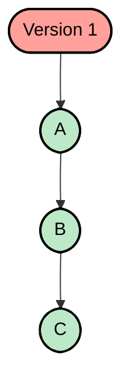
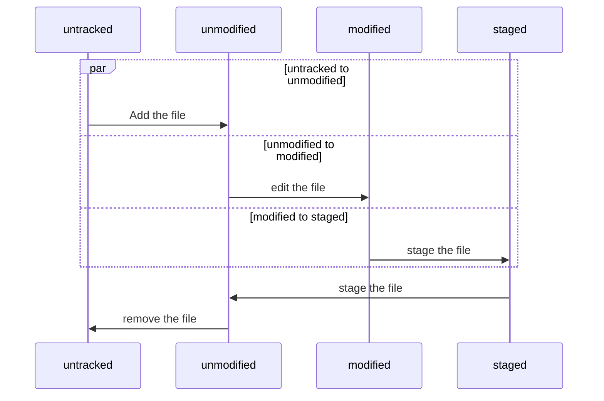

# GIT

## Git 
- Sistema de controle de versão

#### Vantagens
- Velocidade
- Design simples
- Suporte robusto a desevolvimento não linear (milhares de branches paralelos)
- Totalmente distribuído
- Capaz de lidar eficientemente com grandes projetos como o kernel do Linux.

## Github 
- Serviço de web compartilhado para projetos que utilizam o **Git** pata versionamento
- Rede social de projetos

### Outras Alternativas 
- Gitlab
- Bitbucket
- subversion

### Vantagens
- Backups
- Controle de versões
- Trabalhar em equipe
- Portfólio
- Contribuir com projetos Open source

### Instalar e configurar no Windows
- [Site Official](https://git-scm.com/)
- Comandos para configurações do git
    - git config --list
    - git config --global user.name "Teste"
    - git config --global user.email "teste@gmail.com"
    - git config --global core.editor "caminho do editor"
- Visualizar configurações específicas
    - git config core.editor
    - git config user.email
### Iniciando GIT
- git init

### Ciclo de vida do Status
- untracked: **Ainda não foi visto pelo git**
- unmodified: **Não teve modificação**
- modified: **Foi editado, mas não foi salvo**
- staged: **Pronto pra commitar**

### Processo do GIT
| Processo                      |
| :---------------------------: |
| WORKING DIRECTORY             |
|   *git add .*                 |
| STAGING AREA                  |
| *git commit -m "mensagem"*    |
| REPOSITORY                    |

### Comandos Básicos
- Inicia o repositorio
    - git init
- Status do git
    - git status
- Adiciona os arquivos
    - git add .
    - git add *
    - git add nome-arquivo.txt
- Envia os arquivos para a stagin area
    - git commit -m "mensagem
    - **Sem precisar dar git add**
    - git commit -am "mensagem
    - Adiciona e comitar tudo
        - git commit -ma "mensagem
- Adiciona a um reporitório remoto
    - git push
- Logs do git
    - git log
    - **Mostra sobre branches, Tags**
    - git log --decorate
    - **Filtra por author**
    - git log --author="andre"
    - **Log em ordem**
    - git shortlog
    - **Quantidade de logs e author**
    - git shortlog -sn

- Logs Reduzidos
    - git log --oneline
- Vê o desenho do grafo de commits
    - git log --graph
    - git log --graph --oneline
- Ramo que o projeto esta
    - git branch
- Verifica se já esté em um repositório remoto
    - gti remote
- Mostra a descrição de arquivo específico
    - git show hash_do_commit
- **Vê mudanças antes de enviar**
     - git diff
     - git diff --name-only

### Desfazendo coisas com o reset
- **Alterou o arquivo, mas se arrependeu**
- git checkout nome_arquivo
- **Resetar mudanças depois do ADD**
- git reset HEAD
- **Resetar mudanças depois do COMMIT**
    - Três tipos
        - **--soft**
        - Não desfaz apenas o commit, não destroi as mudanças
        - **--mixed**
        - Não desfaz apenas o commit, volta para antes do stage
        - **--hard**
        - ignora a existência do commit e tudo que foi feito
- git reset HEAD **Escolher commit anterior ao que você quer reverter
- git reset --soft b452888664564c65454c64e6565
- git reset --hard **ele altera o historico de commits, tome cuidado**
#### Rastrear as mudanças nas versões do projeto e recuperar uma versão
- git checkout hash_do_commit
- git branch
- git checkout master

#### Desfazer alterações

    - Em vermelhor arquivos retidos
    - Em verde arquivos adicionados
- git status
- Descarta as mudanças e volta para modo anterior
    - git restore index.html
- Arquivo já adicionado ao container
- git add .
- remove o contaúdo do container
    - git restore --staged . | pode colocar o nome do arquivo no lugar do ponto
    - para remover arquivos do add
        - git restore . | nome do arquivo

#### Excluir um commit
- git reset --hard 3ee9278

#### Criando ramificações do projeto
- Criando nova ramificação
    - git checkout -b novo_ramo
- Crie alguns arquivos no novo_ramo
- add e commit
- volte para a branch master
- Mostra o gráfico de todas as branchs
    - git log --oneline --graph --all
- faça alterações no ramo master, de preferencia faça nos mesmo arquivos da novo_ramo
- add e commit

- **git merge novo_ramo**
- Quando a conflitos no GIT
- VS Code alerta
    - Accept current change
        - Mantém a linha do ramo master
    - Accept incoming change
        - Mantém arquivo do novo_ramo
    - Accept both changes
        - Mantém arquivo de ambos
    - Compare changes
        - Comparação refinada

Aula 09

## Referências
[Willian Justen Cursos- Curso de Git básico](https://www.youtube.com/watch?v=g2uviTb8ZpE&list=PLlAbYrWSYTiPA2iEiQ2PF_A9j__C4hi0A&index=14&ab_channel=WillianJustenCursos)

[Curso GIT e GITHUB](https://www.youtube.com/watch?v=Xsulc8agj_A&list=PLbEOwbQR9lqzK14I7OOeREEIE4k6rjgIj&index=10&ab_channel=ProfessorJos%C3%A9deAssis)