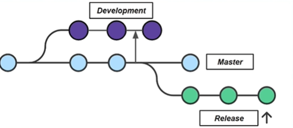

# Integração Contínua

> O ideal é que tenhamos uma integração contínua, pequenas alterações todo o tempo, e assim garantir que o software funcione de maneira adequada. Dessa maneira teremos sempre um feedback rápido.

### Benefícios do uso da prática de Integração Contínua
- As falhas são detectadas mais rapidamente
- Integrações mais simples

- O que é mais natural é utilizar um repositório para cada projeto, de um tamanho razoável com escopo bem definido. Essa forma de organização é chamada **Multi-repo**.

- Empresas que atuam com outra dimensão de projetos utilizam o **Mono-repo**, ou seja, um único e gigantesco repositório que acumula todos os projetos.

- Branching Models

