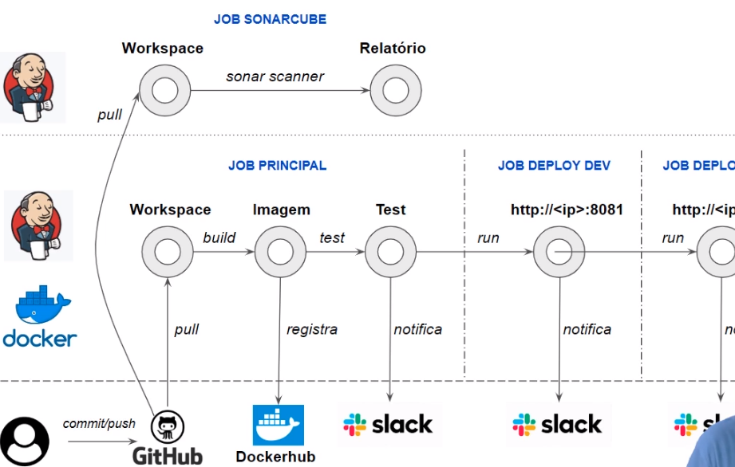
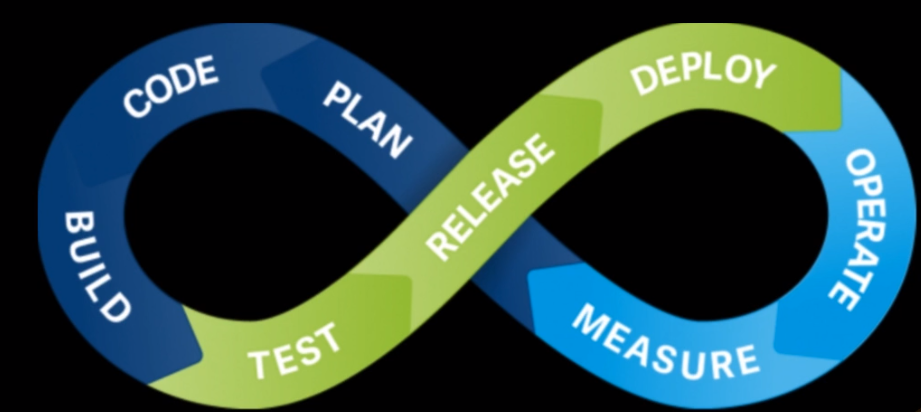

# Jenkins e Docker: Pipeline de entrega continua

- SonarQube
- Jenkins
- Pipeline
- Docker
- Slack
- CI/CD





## Vagrantfile
- config.vm.box 
    - Qual S.O vai usar
- config.disksize.size
    - Quanto de disco vai usar
- config.vm.network
    - Mapeamento das portas
- ip
    - Que será utilizado em quase tudo
- vb.memory
    - Quanto de memória vai usar

### Comandos vagrant
- sudo apt update
- sudo apt upgrade
- sudo add-apt-repository multiverse
- wget -q https://www.virtualbox.org/download/oracle_vbox_2016.asc -O- | sudo apt-key add -
echo "deb [arch=amd64] http://download.virtualbox.org/virtualbox/debian $(lsb_release -sc) contrib" | sudo tee /etc/apt/sources.list.d/virtualbox.list
- sudo apt update
- sudo apt install virtualbox-6.1
- sudo usermod -aG vboxusers $USER

> Caso der esse erro: 
```
 The vboxdrv kernel module is not loaded. Either there is no module
available for the current kernel (6.2.0-32-generic) or it failed to
load. Please recompile the kernel module and install it by

sudo /sbin/vboxconfig

You will not be able to start VMs until this problem is fixed.
6.1.46r158378
```
- sudo /sbin/vboxconfig
> Ao persistir o erro
- Tem que desativar o boot seguro
    - Ligue seu sistema
    - Pressione a tecla F2 enquanto o sistema estiver sendo - iniciado
    - Você acessará o utilitário de configuração do sistema
    - Clique na guia Boot
    - Realce a opção Secure Boot (Boot seguro)
    - Pressione Enter, selecione Disable e pressione Enter - novamente.
    - Pressione F10 e selecione Yes

- VBoxManage --version
- sudo apt install vagrant
- vagrant init
- vagrant -h

sudo service jenkins stop && sudo service jenkins start && sudo service jenkins status

## Comandos Jenkins
- sudo systemctl enable jenkins
- sudo systemctl start jenkins
- sudo systemctl status jenkins
- [Acesso Jenkins Local](http://localhost:8080)

### Configurando o ambiente e conectando a máquina virtual
```
# Configurando o ambiente e conectando máquina virtual:
    # Máquina virtual com o vagrant
    # Requisitos: http://vagrantup.com e https://www.virtualbox.org/
        # Baixar e descompactar o arquivo 1110-aula-inicial.zip
        # Entendendo o Vagranfile
        # Subindo o ambiente virtualizado
            vagrant plugin install vagrant-disksize
            vagrant up
            vagrant ssh
                ps -ef | grep -i mysql # Verificando se o MySQL esta rodando
                mysql -u devops -p # Senha mestre; show databases
                mysql -u devops_dev -p # Senha mestre; show databases
                # Instalando o Jenkins
                    cd /vagrant/scripts
                # Visualizar o conteudo do arquivo de instalacao do jenkins
                    sudo ./jenkins.sh

                # Acessar:  192.168.56.10:8080
                    sudo cat /var/lib/jenkins/secrets/initialAdminPassword

                # Credenciais
                    Nome de usuário: alura
                    Senha: mestre123
                    Nome completo: Jenkins Alura
                    Email: aluno@alura.com.br

                # Reload nas permissoes do docker
                    sudo usermod -aG docker $USER
                    sudo usermod -aG docker jenkins
                    exit
            vagrant reload
```

- Vê se o Mysql foi instalado
`ps -ef | grep -i mysql`
- Acessar banco: `mysql -u devops_dev -p ` senha `mestre`
- Acessar banco: `mysql -u devops -p ` senha `mestre`
 